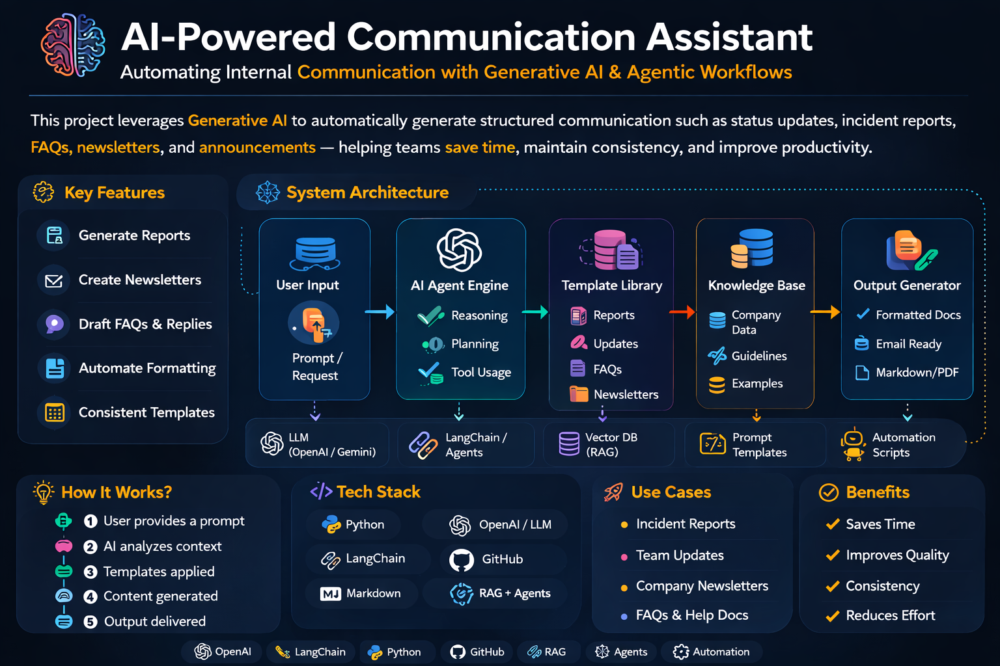

# SafeMGM — AI-Powered Public Safety Intelligence (Montgomery, AL)


*A "Command Center" view of Montgomery's public safety trends and AI-driven analysis.*

**SafeMGM** turns raw public safety records into a single, judge-ready dashboard you can query in plain English—combining **local 911 + crime datasets**, an **interactive safety map**, **trend analytics**, and **news context enrichment**.

Built for the **World Wide Vibes Hackathon (GenAI.Works Academy)** by **Abdullah Malik**.

---

## GenAI Architecture



## Agentic Workflow


---

## 🖼️ Dashboard Screenshots
| AI Analyst Terminal | Geospatial Intelligence Map |
| :---: | :---: |
|  |  |

---

## Why it matters
Cities publish important safety data, but it’s often shipped as static CSV/GeoJSON files—hard to interpret quickly, and missing the “what’s happening right now” context.

SafeMGM bridges that gap:
- **Citizens** can ask natural-language questions (no spreadsheets).
- **Community leaders** can quickly spot patterns (map + trends).
- **Judges** can evaluate a complete end-to-end GenAI product: retrieval/context building → streaming chat → real-time enrichment → graceful fallbacks.

---

## What you can do in the app
- **AI Safety Analyst (streaming chat)**: Ask questions like “Any spikes in 911 calls?” or “Safety near downtown” and get data-cited answers.
- **Geospatial “Command Center” map**: Leaflet map with severity-coded incidents (from local GeoJSON).
- **Trend analytics**: 12-month chart comparing 911 call volume vs. crime incidents.
- **News enrichment**: A live news panel for the active query (Bright Data / NewsAPI), with **graceful degradation** to sample articles so demos never break.

---

## Live demo script (what to show judges)
1. **Open dashboard** → point out **stats cards**, **trend chart**, **map**, **AI Terminal**, and **news feed**.
2. Ask the AI Terminal:
   - “Compare crime across neighborhoods”
   - “Any unusual spikes in 911 calls?”
   - “Tell me about safety near downtown”
3. Change the question and show the **News Panel updating** with the same query context.
4. Explain the reliability story:
   - If **Gemini key is missing**, `/api/chat` returns a clear 503 configuration error.
   - If **news keys are missing**, the app returns **sample news** (demo still works).
   - If **Gemini key is missing/rate-limited**, `/api/stats` falls back to a static safety score so the dashboard still loads.

---

## Architecture (high level)
- **Next.js 15 App Router** UI in `src/app/page.tsx`
- **Local datasets** in `src/data/`
  - `911-calls.csv`
  - `crime-stats.csv`
  - `crime-mapping.geojson`
- **Server-side data loader + context builder** in `src/lib/montgomery-data.ts`
  - Builds a bounded “AI context” summary (top crimes, trends, recent incidents) for safe prompting.
- **AI streaming** via Vercel AI SDK + Google Gemini in `src/app/api/chat/route.ts`
  - Streams responses to the client using the `useChat` hook.
- **News enrichment** via `src/app/api/news/route.ts` + `src/lib/brightdata.ts`
  - **Primary**: NewsAPI.org (no credit card)
  - **Fallback**: Bright Data SERP API
  - **Fallback of last resort**: sample news (keeps the demo working)

---

## API routes (for reviewers)
- **`GET /api/stats`**: totals + top crime type + safety score (AI-powered when available)
- **`GET /api/trends`**: monthly trend series for charts
- **`GET /api/data`**: dataset access (supports filters)
  - `?dataset=911|crime|mapping`
  - Optional: `limit`, `neighborhood`, `dateStart`, `dateEnd`, `incidentType`
- **`GET /api/news?q=...`**: news articles for the News Panel (always returns 200 with `{ articles: [] }` on failure)
- **`POST /api/chat`**: streaming AI chat

---

## Tech stack
- **Framework**: Next.js 15 (App Router), React 19, TypeScript
- **UI**: Tailwind CSS + shadcn/ui
- **AI**: Vercel AI SDK (`ai`, `@ai-sdk/react`) + Google Gemini (`@ai-sdk/google`)
- **Mapping**: Leaflet + react-leaflet (CartoDB Dark Matter tiles)
- **Charts**: Recharts
- **Data parsing**: PapaParse
- **Deploy**: Vercel (`maxDuration: 60` on chat route)

---

## Getting started (local)
### Prereqs
- Node.js 20+ recommended

### Install & run
```bash
npm install
npm run dev
```
Then open `http://localhost:3000`.

---

## Environment variables
Copy `.env.example` to `.env.local` and fill what you have.

### Required for AI chat
- **`GOOGLE_GENERATIVE_AI_API_KEY`**: required for `/api/chat` (Gemini streaming)

### Optional (news enrichment)
- **`NEWS_API_KEY`**: enables NewsAPI.org results (recommended for easy demos)
- **`BRIGHT_DATA_API_TOKEN`** + **`BRIGHT_DATA_SERP_ZONE`**: enables Bright Data SERP fallback

If no news keys are provided, SafeMGM returns **sample news** to keep the UI functional for demos.

---

## Hackathon track
- **Track**: Public Safety & Community Resilience (GenAI for Social Good)
- **Challenge**: Transforming static municipal data into real-time, citizen-centric insights.

---

## Commercialization & Scalability
SafeMGM is designed with a **city-agnostic architecture**, meaning it can be deployed for any city that provides CSV or GeoJSON open data (standard for 3,000+ US municipalities).
- **SaaS for Small-Mid Cities**: Many cities lack the budget for custom safety dashboards. SafeMGM can be offered as a "Dashboard-as-a-Service."
- **Real Estate Integration**: APIs for neighborhood safety scores can be sold to real estate platforms.
- **Enterprise Enrichment**: Insurance companies can use the trend analytics for risk assessment.

---

## Data sources & ethics
- Uses local datasets stored in `src/data/` (CSV/GeoJSON) and summarizes them for analysis.
- **Important**: The app provides **informational insights** only; it does not predict individual behavior or provide emergency services. Always call 911 in an emergency.

---

## Built by
**Abdullah Malik**  
- GitHub: `https://github.com/AbdullahMalik17`  
- Repo: `https://github.com/AbdullahMalik17/WW_Hacathan`
